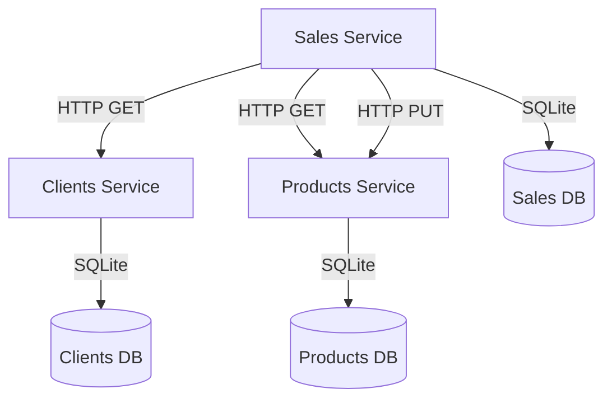

# Sistema de Gestión de Ventas - Arquitectura de Microservicios

## Descripción General

Este proyecto implementa un sistema de gestión de ventas utilizando **arquitectura de microservicios** con tres servicios independientes que se comunican vía HTTP. Cada microservicio tiene su propia base de datos y expone una API REST completa.

## Microservicios Implementados

### 1. **Clients Service** (Puerto 3001)
- **Responsabilidades**: Gestión completa del ciclo de vida de clientes
- **Base de datos**: `clients_database.sqlite`
- **Características**: Validación de emails únicos, datos de contacto

### 2. **Products Service** (Puerto 3002)
- **Responsabilidades**: Gestión de productos e inventario
- **Base de datos**: `products_database.sqlite`
- **Características**: Control de stock, precios, actualización automática de inventario

### 3. **Sales Service** (Puerto 3003)
- **Responsabilidades**: Gestión de ventas y transacciones
- **Base de datos**: `sales_database.sqlite`
- **Característica clave**: **Comunicación HTTP** con Clients y Products services

## Comunicación entre Microservicios



**Flujo de venta:**
1. Sales Service recibe solicitud de venta
2. **HTTP call** → valida cliente en Clients Service
3. **HTTP call** → valida stock y obtiene precios de Products Service
4. Calcula total automáticamente
5. **HTTP call** → actualiza stock en Products Service
6. Registra venta en su propia base de datos

## Tecnologías Utilizadas

- **Node.js** con **TypeScript**
- **Express.js** para APIs REST
- **Sequelize ORM** con **SQLite** (bases de datos independientes)
- **Axios** para comunicación HTTP entre servicios
- **Docker** y **Docker Compose** para orquestación

## Instalación y Ejecución

### Prerrequisitos

- Node.js (versión 16 o superior)
- npm
- Docker y Docker Compose

### 🚀 Ejecutar Arquitectura de Microservicios

#### Opción 1: Desarrollo Local
```bash
# Instalar dependencias en cada servicio
cd clients-service && npm install
cd ../products-service && npm install
cd ../sales-service && npm install

# Ejecutar servicios en terminales separadas
cd clients-service && npm run dev    # Puerto 3001
cd products-service && npm run dev   # Puerto 3002
cd sales-service && npm run dev      # Puerto 3003
```

#### Opción 2: Docker Compose (Recomendado)
```bash
# Construir y ejecutar todos los servicios
docker-compose up --build

# Ejecutar en segundo plano
docker-compose up -d --build
```

**URLs**:
- Clients Service: `http://localhost:3001/api`
- Products Service: `http://localhost:3002/api`
- Sales Service: `http://localhost:3003/api`

## API Endpoints

#### Clients Service (Puerto 3001)
**Base URL**: `http://localhost:3001/api`
- `GET /clients` - Obtener todos los clientes
- `GET /clients/:id` - Obtener cliente por ID
- `POST /clients` - Crear nuevo cliente
- `PUT /clients/:id` - Actualizar cliente
- `DELETE /clients/:id` - Eliminar cliente
- `GET /health` - Health check

#### Products Service (Puerto 3002)
**Base URL**: `http://localhost:3002/api`
- `GET /products` - Obtener todos los productos
- `GET /products/:id` - Obtener producto por ID
- `POST /products` - Crear nuevo producto
- `PUT /products/:id` - Actualizar producto
- `PUT /products/:id/stock` - Actualizar stock de producto
- `DELETE /products/:id` - Eliminar producto
- `GET /health` - Health check

#### Sales Service (Puerto 3003)
**Base URL**: `http://localhost:3003/api`
- `GET /sales` - Obtener todas las ventas
- `GET /sales/:id` - Obtener venta por ID
- `GET /sales/client/:clienteId` - Obtener ventas por cliente
- `POST /sales` - Crear nueva venta (comunica con Clients y Products)
- `DELETE /sales/:id` - Eliminar venta
- `GET /health` - Health check

## Estructura del Proyecto

```
/
├── clients-service/                # Microservicio de clientes
│   ├── src/
│   │   ├── config/           # Configuración de BD
│   │   ├── controllers/      # Controladores API
│   │   ├── middleware/       # Middleware personalizado
│   │   ├── models/          # Modelos Sequelize
│   │   ├── repositories/    # Capa de acceso a datos
│   │   ├── routes/          # Definición de rutas
│   │   ├── services/        # Lógica de negocio
│   │   ├── types/           # Tipos TypeScript
│   │   └── app.ts           # Punto de entrada
│   ├── Dockerfile
│   └── package.json
├── products-service/               # Microservicio de productos
│   └── [estructura similar]
├── sales-service/                  # Microservicio de ventas
│   └── [estructura similar]
├── docs/                          # Documentación
├── microservices_postman_collection.json  # Testing
├── docker-compose.yml             # Orquestación
└── README.md
```

## Base de Datos

Cada microservicio utiliza su propia base de datos SQLite:

- **Clients Service**: `clients_database.sqlite`
  - Tabla: `clientes`

- **Products Service**: `products_database.sqlite`
  - Tabla: `productos`

- **Sales Service**: `sales_database.sqlite`
  - Tablas: `ventas`, `venta_productos`

## Testing

Importa `microservices_postman_collection.json` en Postman o Insomnia para probar todos los endpoints.

### Ejemplos de Uso

#### 1. Crear un cliente:
```json
POST http://localhost:3001/api/clients
{
  "nombre": "Juan Pérez",
  "email": "juan.perez@email.com",
  "telefono": "+57 300 123 4567"
}
```

#### 2. Crear un producto:
```json
POST http://localhost:3002/api/products
{
  "nombre": "Laptop Dell",
  "precio": 2500000,
  "stock": 10
}
```

#### 3. Crear una venta:
```json
POST http://localhost:3003/api/sales
{
  "cliente_id": 1,
  "productos": [
    {
      "producto_id": 1,
      "cantidad": 2
    }
  ]
}
```
*Nota: El Sales Service consultará automáticamente los otros servicios*

## Características

- ✅ **Servicios independientes** con bases de datos separadas
- ✅ **Comunicación HTTP** entre servicios (sin bases de datos compartidas)
- ✅ **Validación de datos** y manejo de errores
- ✅ **Transacciones** para operaciones complejas
- ✅ **Control de stock automático** vía HTTP
- ✅ **Cálculo automático de totales**
- ✅ **API RESTful completa** en cada servicio
- ✅ **TypeScript** para type safety
- ✅ **Docker Compose** para orquestación completa

## Documentación

- 📋 [`docs/microservices-architecture.md`](docs/microservices-architecture.md) - Arquitectura de microservicios detallada
- 📋 [`docs/architectural-views.md`](docs/architectural-views.md) - Vistas arquitectónicas
- 🔧 [`microservices_postman_collection.json`](microservices_postman_collection.json) - Colección Postman completa
- 🐳 [`docker-compose.yml`](docker-compose.yml) - Orquestación de servicios

## Equipo de Desarrollo

- Sebastián Molina
- Humberto Fajardo

## Licencia

Este proyecto es parte de la entrega académica para el curso de Desarrollo de Software 2.